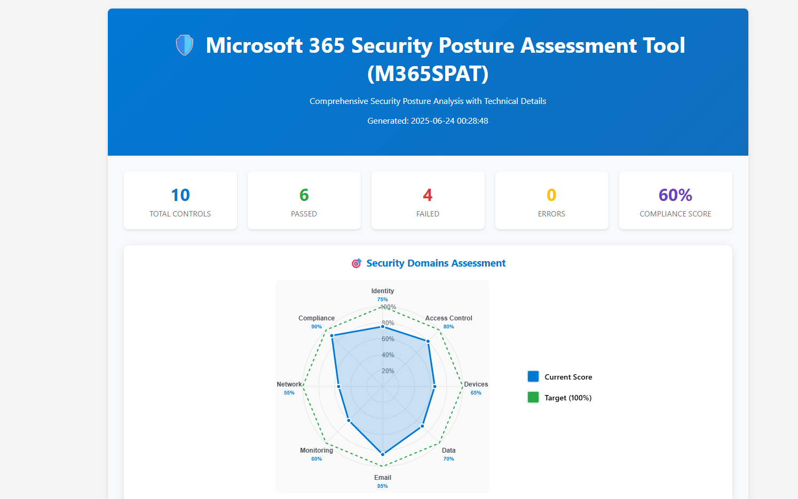

# 🛡️ Microsoft 365 Security Posture Assessment Tool (M365SPAT)

<div align="center">

**Comprehensive security posture analysis for Microsoft 365 environments**

**PowerShell 5.1+ | Azure AD Premium | Microsoft Graph API | MIT License**

[🚀 Quick Start](#-quick-start) • [📋 Features](#-features) • [📖 Documentation](#-documentation) • [🤝 Contributing](#-contributing)

</div>

---

## 🎯 Overview

M365SPAT is an advanced PowerShell-based security assessment tool designed specifically for Microsoft 365 environments. It evaluates your organization's security posture across 22+ critical security controls, providing both technical insights for security professionals and plain-English explanations for business stakeholders.

## 📸 Screenshots

### Interactive Security Assessment Report

*Comprehensive security posture analysis with interactive spider chart showing domain-specific compliance scores*

### 🌟 Why M365SPAT?

- **🔍 Comprehensive Coverage**: 22+ security controls across all major M365 security domains
- **👥 Dual Audience**: Technical details for security engineers, simple explanations for executives
- **📊 Beautiful Reports**: Interactive HTML reports with evidence collection and remediation guidance
- **🚀 Easy to Use**: One-command execution with certificate or client secret authentication
- **🔄 Actionable Results**: Detailed remediation steps with PowerShell commands and API examples

## 🚀 Quick Start

### Prerequisites

- PowerShell 5.1 or later
- Azure AD app registration with appropriate permissions
- Microsoft 365 E3/E5 or equivalent licensing

### 🔧 Installation

1. **Clone the repository**
   ```powershell
   git clone https://github.com/laythchebbi/M365SPAT.git
   cd M365SPAT
   ```

2. **Set up Azure AD App Registration**
   ```powershell
   # Required permissions (add to your Azure AD app):
   # - Policy.Read.All
   # - Directory.Read.All
   # - Reports.Read.All
   # - DeviceManagementConfiguration.Read.All
   # - And more... (see documentation)
   ```

3. **Run the assessment**
   ```powershell
   # Using certificate authentication (recommended)
   .\M365SecurityAssessment.ps1 -TenantId "your-tenant-id" -ClientId "your-client-id" -CertificateThumbprint "cert-thumbprint"
   
   # Using client secret
   .\M365SecurityAssessment.ps1 -TenantId "your-tenant-id" -ClientId "your-client-id" -ClientSecret "your-secret"
   ```

4. **View the results**
   
   Open the generated HTML report in your browser to view the interactive dashboard with:
   - Overall compliance scoring and statistics
   - Interactive spider chart showing domain-specific security posture
   - Detailed control analysis with simple and technical explanations
   - Actionable remediation guidance with PowerShell commands and API examples

### 📊 Sample Output

```
=== Microsoft 365 Security Assessment Tool ===
Tenant ID: contoso.onmicrosoft.com
Authentication Method: Certificate
✓ Authentication successful
✓ Loaded 22 security controls
✓ Assessment completed
✓ Reports generated

=== Assessment Summary ===
Total Controls: 22
Passed: 16
Failed: 4
Errors: 2
Compliance Score: 72.7%

📁 Reports saved to:
   JSON: .\reports\AssessmentResults_20250623_143052.json
   HTML: .\reports\AssessmentReport_20250623_143052.html
```

## 📋 Features

### 🔒 Security Domains Covered

| Domain | Controls | Description |
|--------|----------|-------------|
| **🔐 Identity & Authentication** | 5 | MFA, Legacy Auth, Passwordless |
| **🎯 Conditional Access** | 4 | Location-based, Device compliance, Risk-based |
| **👥 Role Management** | 3 | Privileged access, Emergency accounts |
| **📱 Device Management** | 1 | Compliance policies, MDM integration |
| **🛡️ Data Protection** | 3 | DLP, Sensitivity labels, External sharing |
| **📧 Email Security** | 1 | Anti-phishing, Safe attachments/links |
| **👥 Collaboration Security** | 1 | Teams security, Guest access |
| **📊 Monitoring & Compliance** | 4 | Audit logs, Alerts, Governance |

### 🎨 Report Features

- **📈 Interactive Dashboards**: Visual compliance scoring and trend analysis
- **🔍 Detailed Evidence**: Complete API responses and analysis logic
- **📝 Simple Explanations**: Business-friendly explanations for each control
- **🔧 Technical Details**: PowerShell commands, API examples, documentation links
- **📋 Remediation Guidance**: Step-by-step instructions with time estimates
- **📊 Compliance Mapping**: CIS and NIST framework alignment

### 🚀 Advanced Features

- **Certificate-based Authentication**: Secure, automated execution
- **Modular Architecture**: Easy to extend with custom controls
- **Evidence Collection**: Complete audit trail for compliance
- **Risk-based Prioritization**: Focus on critical security gaps
- **Export Capabilities**: JSON, HTML, and CSV output formats

## 📖 Documentation

### 🏗️ Architecture

```
M365SPAT/
├── 📁 reports/                    # Generated assessment reports
├── 📁 docs/                       # Documentation and screenshots
│   └── 📁 images/                 # Screenshots and diagrams
├── 📄 M365SecurityAssessment.ps1  # Main execution script
├── 📄 AuthenticationModule.ps1    # Azure AD authentication
├── 📄 AssessmentEngine.ps1        # Core assessment logic
├── 📄 HtmlReportGenerator.ps1     # Report generation
├── 📄 SecurityControls.json       # Control definitions
├── 📄 styles.css                  # Report styling
├── 📄 scripts.js                  # Interactive features
├── 📄 .gitignore                  # Git ignore rules
└── 📄 README.md                   # This file
```

### 🔑 Security Controls

<details>
<summary><strong>Identity & Authentication Controls</strong></summary>

- **IAM-AUTH-001**: Multi-Factor Authentication Enforcement
- **IAM-AUTH-002**: Privileged User MFA Enforcement
- **IAM-AUTH-003**: MFA Registration Campaign
- **IAM-AUTH-004**: Legacy Authentication Blocking
- **IAM-AUTH-005**: Passwordless Authentication Configuration

</details>

<details>
<summary><strong>Conditional Access Controls</strong></summary>

- **IAM-CA-001**: Policy Coverage Analysis
- **IAM-CA-002**: Location-Based Access Control
- **IAM-CA-003**: Device Compliance Integration
- **IAM-CA-004**: Risk-Based Conditional Access

</details>

<details>
<summary><strong>Role Management Controls</strong></summary>

- **IAM-ROL-001**: Global Administrator Count Verification
- **IAM-ROL-002**: Privileged Role Assignment Review
- **IAM-ROL-003**: Emergency Access Account Configuration

</details>

<details>
<summary><strong>Data Protection Controls</strong></summary>

- **DLP-001**: Data Loss Prevention Policy Configuration
- **APP-001**: Application Registration Security Review
- **SHA-001**: External Sharing Configuration Review

</details>

### 🔧 Configuration

#### Azure AD App Permissions

```json
{
  "requiredResourceAccess": [
    {
      "resourceAppId": "00000003-0000-0000-c000-000000000000",
      "resourceAccess": [
        { "id": "Policy.Read.All", "type": "Role" },
        { "id": "Directory.Read.All", "type": "Role" },
        { "id": "Reports.Read.All", "type": "Role" },
        { "id": "AuditLog.Read.All", "type": "Role" },
        { "id": "RoleManagement.Read.Directory", "type": "Role" },
        { "id": "Application.Read.All", "type": "Role" },
        { "id": "DeviceManagementConfiguration.Read.All", "type": "Role" }
      ]
    }
  ]
}
```

#### Custom Control Development

Add your own security controls by extending `SecurityControls.json`:

```json
{
  "id": "CUSTOM-001",
  "name": "Custom Security Control",
  "description": "Your custom control description",
  "category": "Custom Category",
  "severity": "High",
  "type": "graph_api",
  "endpoint": "https://graph.microsoft.com/v1.0/your-endpoint",
  "evaluation": "$data.value.Count -gt 0",
  "simple_explanation": {
    "what_was_checked": "Plain English explanation",
    "why_it_matters": "Business impact explanation"
  }
}
```

## 🎯 Use Cases

### 🏢 For Organizations

- **Security Posture Assessment**: Comprehensive evaluation of M365 security controls
- **Compliance Reporting**: Generate reports for auditors and stakeholders
- **Risk Management**: Identify and prioritize security gaps
- **Continuous Monitoring**: Regular assessment to maintain security posture

### 👨‍💼 For Security Teams

- **Technical Deep Dive**: Detailed control analysis with remediation steps
- **Evidence Collection**: Complete audit trail for security assessments
- **Automation**: Integrate into CI/CD pipelines for continuous assessment
- **Knowledge Transfer**: Training tool for junior security analysts

### 🎓 For Consultants

- **Client Assessments**: Professional security posture reports
- **Baseline Establishment**: Document current state before improvements
- **Progress Tracking**: Before/after comparison reports
- **Proposal Support**: Technical evidence for security recommendations

## 🛡️ Security & Privacy

M365SPAT is designed with security and privacy in mind:

- **🔒 Read-Only Access**: Only requires read permissions, no write operations
- **🔐 Certificate Authentication**: Supports secure certificate-based auth
- **📊 Local Processing**: All analysis performed locally, no data sent to third parties
- **🗂️ Evidence Retention**: Complete audit trail for compliance requirements

## 🤝 Contributing

We welcome contributions! Please see our [Contributing Guidelines](CONTRIBUTING.md) for details.

### 🐛 Reporting Issues

- Use GitHub Issues for bug reports and feature requests
- Include PowerShell version, M365 licensing, and error details
- Check existing issues before creating new ones

### 💻 Development

1. Fork the repository
2. Create a feature branch: `git checkout -b feature/amazing-feature`
3. Commit changes: `git commit -m 'Add amazing feature'`
4. Push to branch: `git push origin feature/amazing-feature`
5. Open a Pull Request

## 📞 Support

- **📖 Documentation**: [Wiki](https://github.com/your-org/M365SPAT/wiki)
- **💬 Discussions**: [GitHub Discussions](https://github.com/your-org/M365SPAT/discussions)
- **🐛 Issues**: [GitHub Issues](https://github.com/your-org/M365SPAT/issues)
- **📧 Contact**: security-tools@your-org.com

## 📜 License

This project is licensed under the MIT License - see the [LICENSE](LICENSE) file for details.

## 🙏 Acknowledgments

- Microsoft Graph API team for excellent documentation
- PowerShell community for modules and best practices
- Security community for feedback and contributions
- CIS and NIST for security control frameworks

---

<div align="center">

**Made with ❤️ by the Security Team**

*Securing Microsoft 365 environments, one assessment at a time*

**⭐ Star this project if you find it useful! • 🍴 Fork it to contribute!**

</div>